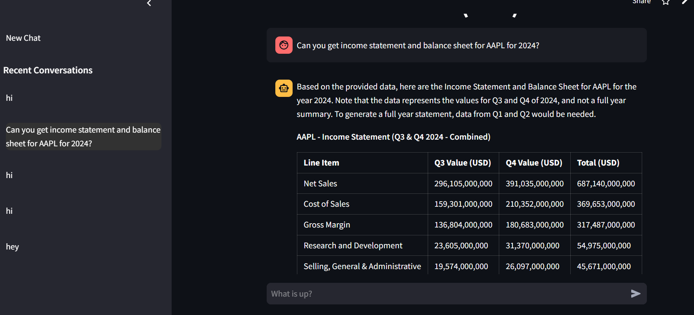
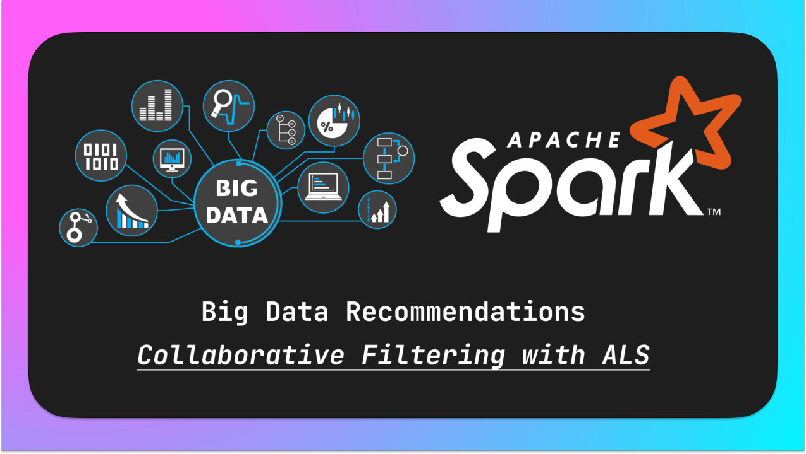

# Pratik Jain Portfolio
---

## Live Apps

### Financial Data Chatbot - Chatbot to get financial data for US Companies
[Financial Data Chatbot](https://financial-data-bot.streamlit.app/)

The Financial Data Bot(USA) is a chatbot designed to provide users with insights and answers from company-reported financial data, such as income statements, balance sheets, and more.

The Financial Data Bot leverages the latest advancements in AI and data processing technologies:

- **Retrieval-Augmented Generation (RAG):** For accurate and context-aware responses.
- **Large Language Models (LLMs):** Powered by **Google Gemini** or **OpenAI** models for natural language understanding.
- **Data Processing:** Efficient handling of financial data using **Pandas** and custom scripts.
- **APIs:** To fetch, process, and serve up-to-date financial data.
- **Streamlit:** For creating an intuitive and interactive web application.
- **PostgreSQL:** For robust and scalable data storage and retrieval.
- **Python:** The backbone of the application, powering logic, data processing, and integrations.

---
 

### Instant Search - RAG based Document Retrival System
[Instant Search](https://instantsearch-app.streamlit.app/)

This chatbot is designed to provide accurate, context-aware answers by leveraging your custom database. You can upload files or add links directly through the user interface to build a personalized knowledge base. The chatbot uses advanced AI techniques to process and retrieve information, ensuring reliable and precise responses tailored to your needs.

Tech Stack:
- **Retrieval-Augmented Generation (RAG)**: Ensures accurate and context-aware responses.
- **Large Language Models (LLMs)**: Powered by **Google Gemini** or **OpenAI** models for natural language understanding.
- **Data Processing**: Efficient handling of data using **Pandas** and custom scripts.
- **Streamlit**: Provides an intuitive and interactive web interface.
- **Python**: Powers all application logic, data processing, and integrations.
- **Vector Database(Pinecone)**: Ensures fast and relevant information retrieval.
- **Web Scraping**: Uses **Beautiful Soup** to extract and structure data from online sources.
- **Document Parsing**: Supports PDF and Word documents for database creation.

---
 

## Machine learning

### Credit Card Fraud Detection

Fraud detection is a set of processes and analyses that allow businesses to identify and prevent unauthorized financial activity. This project aims to predict fraudulent credit card transactions using machine learning models. The dataset used is highly imbalanced, with a significantly higher number of non-fraudulent transactions compared to fraudulent ones.

 

### Melanoma Detection using CNN

This project aims to build a CNN-based model that can accurately detect melanoma, a deadly type of skin cancer. Early detection of melanoma is crucial for successful treatment, and this solution has the potential to reduce manual effort in diagnosis.

 

### Recommendation Model using Pyspark

This project explores a recipie rating data and builds a collaborative filtering model to predict recipe ratings, which can be used to recommend new dishes to users. It involves data cleaning, exploratory data analysis (EDA), feature selection, model training, and evaluation.

 

### NER - Identifying Entities in Healthcare Data

This project uses a Conditional Random Field model to automatically identify key entities, like diseases and treatments, in unstructured healthcare text for various healthcare applications.

---
