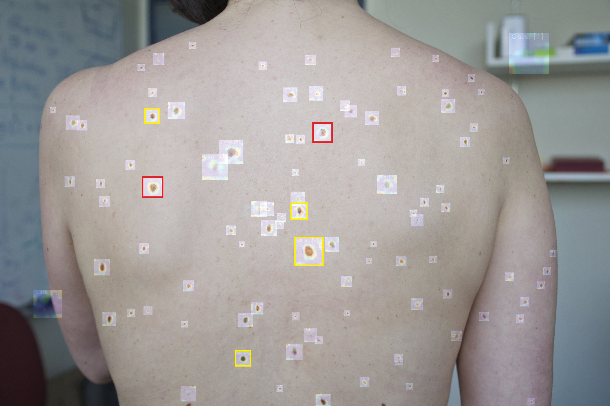
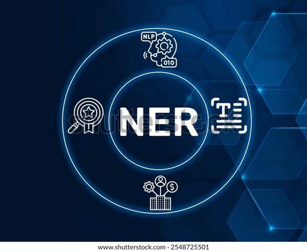

# Data Science Portfolio

## Live Apps

### Instant Search - RAG based Document Retrival System
[Instant Search](https://instantsearch-app.streamlit.app/)

---
## Machine learning

### Credit Card Fraud Detection

Fraud detection is a set of processes and analyses that allow businesses to identify and prevent unauthorized financial activity. This project aims to predict fraudulent credit card transactions using machine learning models. The dataset used is highly imbalanced, with a significantly higher number of non-fraudulent transactions compared to fraudulent ones.

### Melanoma Detection using CNN

This project aims to build a CNN-based model that can accurately detect melanoma, a deadly type of skin cancer. Early detection of melanoma is crucial for successful treatment, and this solution has the potential to reduce manual effort in diagnosis.

### Recommendation Model using Pyspark

This project explores a recipie rating data and builds a collaborative filtering model to predict recipe ratings, which can be used to recommend new dishes to users. It involves data cleaning, exploratory data analysis (EDA), feature selection, model training, and evaluation.

### NER - Identifying Entities in Healthcare Data

This project uses a Conditional Random Field model to automatically identify key entities, like diseases and treatments, in unstructured healthcare text for various healthcare applications.

---
